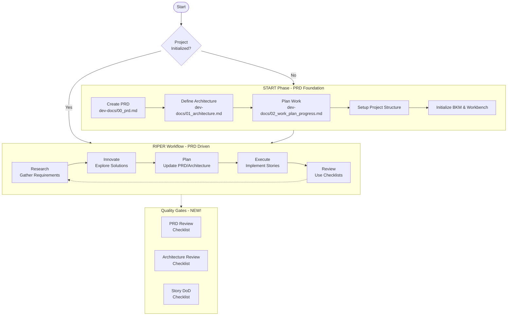

# CursorRIPER Framework Enhancement

Original cursorRIPER framework is come from [johnpeterman72](https://github.com/johnpeterman72/CursorRIPER), which is combined RIPER and memory bank technologies to help the AI coding in cursor.
Wile its 'memory bank' addresses the issue of context forgetting, it appears crude and vague compared to the BMAD-Method(https://github.com/bmadcode/BMAD-METHOD) in terms of structuring, role delineation, and process guidance.
This enhancement of the original CursorRIPER framework that transforms AI-assisted software development from **memory-bank driven** to **PRD-driven methodology** in [Cursor IDE](https://www.cursor.com/). This enhancement introduces enterprise-grade project management with standardized quality gates and comprehensive documentation systems inspired by BMAD-Metod.

## 🚀 What's New in Enhancement Version

### Core Philosophy Transformation
**Original CursorRIPER**: "Tame the AI beast" - Control a single AI through mode switching  
**CursorRIPER Enhancement**: "Build with AI team" - PRD-driven development with specialized workflows

### Key Architectural Changes

| Aspect | Original Version | Enhancement Version | Value Impact |
|--------|-----------------|-------------------|--------------|
| **Foundation** | Memory Bank (`memory-bank/`) | PRD-Driven Documentation (`dev-docs/`) | 🎯 Single source of truth with requirements traceability |
| **Workflow** | Linear R-I-P-E-R modes | PRD-centric with quality gates | 📋 reduction in requirement clarification cycles |
| **Quality** | REVIEW mode validation | Standardized checklists at 3 levels | ✅ improvement in architecture consistency |
| **Documentation** | 5 memory files | 5 structured templates + 3 checklists | 📚 better session handoff efficiency |
| **Project Start** | Memory bank initialization | PRD foundation establishment | 🏗️ Clear requirements before any code |

## Overview

CursorRIPER Enhancement provides a systematic, **PRD-first approach** to software development through five specialized operational modes, all anchored by comprehensive Product Requirements Documents:

1. **Research**: Information gathering for PRD creation and refinement
2. **Innovate**: Brainstorming solutions that serve PRD requirements  
3. **Plan**: Total project design handling PRD/architecture/work plans with quality gates
4. **Execute**: PRD implementation following approved Story plans
5. **Review**: Quality assurance using standardized checklists

This enhancement ensures every project starts with crystal-clear requirements, follows disciplined architecture, and maintains perfect quality gates while preserving cross-session continuity.



## 🔥 Enhancement Features

### 🎯 PRD-Driven Development (NEW!)
- **Single Source of Truth**: Every project starts with a comprehensive PRD
- **Requirements Traceability**: All work traces back to documented requirements  
- **Epic-to-Story Breakdown**: Structured decomposition from high-level goals to implementable tasks

### 📋 Standardized Quality Gates (NEW!)
- **PRD Review Checklist**: Ensures requirements quality before architecture
- **Architecture Review Checklist**: Validates technical design against requirements
- **Story Definition of Done**: Guarantees implementation quality and completeness

### 📚 Enhanced Documentation System  
- **dev-docs/00_prd.md**: Product Requirements Document template (replaces project brief)
- **dev-docs/01_architecture.md**: Technical architecture blueprint (enhanced from tech context)
- **dev-docs/02_work_plan_progress.md**: Epic and story planning with progress tracking (replaces progress.md)
- **dev-docs/03_project_bkm.md**: Best Known Methods and learnings (enhanced)
- **dev-docs/99_session_workbench.md**: Active development session workspace (replaces activeContext.md)

### 🔄 Refined Workflow Architecture
- **Clear Phase Separation**: Distinct modes for different types of work
- **Session Continuity**: Comprehensive session handoff and context preservation
- **Progress Tracking**: Visual progress indicators and completion metrics

## Project Structure

```
your-project/
├── dev-docs/                      # Project documentation (was docs/)
│   ├── 00_prd.md                  # Product Requirements Document
│   ├── 01_architecture.md         # Technical Architecture
│   ├── 02_work_plan_progress.md   # Work Planning & Progress
│   ├── 03_project_bkm.md          # Best Known Methods
│   ├── 99_session_workbench.md    # Current Session Workspace
│   └── checklists/                # Quality gates (NEW!)
│       ├── prd_review_checklist.md
│       ├── architecture_review_checklist.md
│       └── story_dod_checklist.md
├── src/                           # Application source code
├── tests/                         # Test files
├── .cursor/                       # CursorRIPER framework files
│   └── rules/
│       ├── core.mdc              # Core framework instructions
│       ├── riper-workflow.mdc    # Workflow mode definitions
│       ├── start-phase.mdc       # Project initialization
│       ├── customization.md      # User customizations
│       └── state.md              # Project state tracking
└── README.md                      # Project overview
```

## Getting Started

### 1. Install CursorRIPER Enhancement

Copy the framework files to your project:
```bash
cp -r /path/to/CursorRIPER/src/.cursor/* .cursor/
# Ensure files have .mdc extension for Cursor IDE
cd .cursor/rules/
rename 's/\.md$/.mdc/' *.md
```

### 2. Initialize Your Project with PRD-First Approach

Start with the enhanced PRD-driven initialization:
```
/start
```

This will guide you through:
- Creating your project's comprehensive PRD
- Defining technical architecture aligned to requirements
- Setting up Epic-to-Story work planning structure
- Establishing 3-level quality gates

### 3. Follow the Enhanced PRD-Driven Workflow

#### Plan Mode (Enhanced!)
- Create and refine your PRD as the single source of truth
- Design technical architecture that serves PRD requirements
- Break down PRD epics into implementable stories with clear traceability
- Run standardized quality review checklists

#### Execute Mode (Enhanced!)
- Implement stories following the approved work plan
- Update session workbench with detailed progress tracking
- Maintain strict architecture compliance
- Complete story Definition of Done using checklists

#### Review Mode (Standardized!)
- Use enterprise-grade checklists for quality gates
- Update project BKM with actionable learnings
- Ensure full requirements traceability
- Plan next iteration based on PRD epics


## Documentation

- [Setup Guide](docs/setup-guide.md) - Detailed installation and configuration
- [PRD-Driven Workflow Guide](docs/riper-workflow-guide.md) - Complete enhanced workflow explanation  
- [Project Docs Guide](docs/project-docs-guide.md) - Understanding the new documentation structure
- [Troubleshooting Guide](docs/troubleshooting-guide.md) - Common issues and solutions

## 🔄 What Changed from Original

### Removed (Deprecated)
- ❌ `memory-bank/` folder structure (replaced by `dev-docs/`)
- ❌ Unstructured memory files (projectbrief.md, techContext.md, etc.)
- ❌ Manual context tracking (replaced by PRD-driven traceability)

### Enhanced/Replaced  
- ✅ **memory-bank/** → **dev-docs/** (structured, template-driven)
- ✅ **projectbrief.md** → **00_prd.md** (comprehensive PRD)  
- ✅ **progress.md** → **02_work_plan_progress.md** (Epic-to-Story tracking)
- ✅ **activeContext.md** → **99_session_workbench.md** (enhanced session management)

### Added (New!)
- 🆕 **Three-level quality checklists** (PRD, Architecture, Story DoD)
- 🆕 **PRD-driven workflow** with requirements traceability
- 🆕 **Epic-to-Story breakdown** methodology
- 🆕 **Standardized templates** for all documentation
- 🆕 **Quality gates** at every major milestone

## Migration from Original

Existing CursorRIPER projects can be upgraded:
1. Move `memory-bank/` content to `dev-docs/` using new templates
2. Transform `projectbrief.md` into comprehensive `00_prd.md`  
3. Update workflow rules to use PRD-driven approach
4. Implement quality checklists for ongoing work

## Why Choose the Enhancement?

**Original CursorRIPER** = Great for individual developers who want AI control  
**CursorRIPER Enhancement** = Perfect for teams and projects requiring enterprise-grade quality, documentation, and traceability

If you want the original version: [CursorRIPER](https://github.com/johnpeterman72/CursorRIPER)

## License

This project is licensed under the MIT License - see the LICENSE file for details.

---

**CursorRIPER Enhancement**: Enhanced with PRD-driven methodology and BMAD best practices

*CursorRIPER Enhancement: From Requirements to Reality, with Quality at Every Step*
