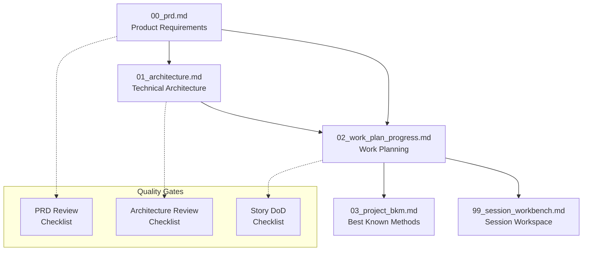

# CursorRIPER Framework 2.0 - Project Documentation Guide

The Project Documentation system is the foundation of CursorRIPER Framework 2.0, providing a comprehensive, PRD-driven approach to project management and development. This guide explains how to effectively use and maintain your project documentation.

## Documentation Overview

## Core Documentation Files

### 1. Product Requirements Document (00_prd.md)

**Purpose**: Single source of truth for all project requirements

**Content**:
- Project vision and objectives
- Target user personas and needs
- Functional and non-functional requirements
- Epic breakdown with acceptance criteria
- Success metrics and KPIs
- Technical and business constraints

**When to Update**:
- During initial project setup
- When requirements change or evolve
- After user research or stakeholder feedback
- Before major architecture decisions

**Key Principles**:
- All work must trace back to PRD requirements
- Epics should be user-focused and valuable
- Acceptance criteria must be testable
- Requirements should follow SMART criteria

### 2. Technical Architecture (01_architecture.md)

**Purpose**: Technical blueprint serving PRD requirements

**Content**:
- System architecture overview
- Technology stack decisions
- Component design and relationships
- Data flow and storage design
- Security and performance considerations
- Deployment and infrastructure plans

**When to Update**:
- After PRD approval
- When technical decisions are made
- During architecture reviews
- When scaling or performance requirements change

**Key Principles**:
- Architecture must serve PRD requirements
- All technical decisions should have clear rationales
- Consider non-functional requirements from PRD
- Design for Epic implementation

### 3. Work Plan and Progress (02_work_plan_progress.md)

**Purpose**: Epic-to-Story breakdown and progress tracking

**Content**:
- Epic decomposition into implementable Stories
- Story acceptance criteria and dependencies
- Sprint/iteration planning
- Progress tracking and completion status
- Timeline and milestone management

**When to Update**:
- After PRD and architecture approval
- During sprint planning
- As Stories are completed
- When priorities or timelines change

**Key Principles**:
- Stories must trace back to PRD Epics
- Each Story should be implementable in 1-3 days
- Clear acceptance criteria for each Story
- Dependencies should be identified and managed

### 4. Best Known Methods (03_project_bkm.md)

**Purpose**: Project knowledge base and lessons learned

**Content**:
- Technical decisions and rationales
- Implementation patterns and solutions
- Lessons learned and retrospectives
- Code standards and conventions
- Troubleshooting guides and solutions

**When to Update**:
- After significant technical decisions
- When implementing new patterns
- During retrospectives
- When solving complex problems

**Key Principles**:
- Capture decision context and rationale
- Document both successes and failures
- Make knowledge searchable and accessible
- Update regularly to stay current

### 5. Session Workbench (99_session_workbench.md)

**Purpose**: Active development workspace and session context

**Content**:
- Current Story being worked on
- Implementation plan for active Story
- Session goals and progress
- Context for session handoff
- Next steps and blockers

**When to Update**:
- At the start of each development session
- During Story implementation
- When switching between Stories
- At the end of each session

**Key Principles**:
- Always reflects current work state
- Provides context for session continuity
- Links to relevant PRD and work plan sections
- Clear handoff information

## Quality Gates and Checklists

### PRD Review Checklist (checklists/prd_review_checklist.md)

**Purpose**: Ensure PRD quality before architecture planning

**Use When**:
- After initial PRD creation
- Before architecture design begins
- When PRD undergoes major changes
- During project reviews

### Architecture Review Checklist (checklists/architecture_review_checklist.md)

**Purpose**: Validate technical design against PRD requirements

**Use When**:
- After architecture document completion
- Before implementation begins
- When architecture changes are proposed
- During technical reviews

### Story Definition of Done Checklist (checklists/story_dod_checklist.md)

**Purpose**: Ensure Story completion meets quality standards

**Use When**:
- Before marking any Story as complete
- During code reviews
- Before Story acceptance
- During sprint retrospectives

## Documentation Workflow

### 1. Project Initialization
1. Create PRD using template_00_prd.md
2. Run PRD review checklist
3. Create architecture based on approved PRD
4. Run architecture review checklist
5. Break down Epics into Stories
6. Set up BKM and session workbench

### 2. Development Cycle
1. Select Story from work plan
2. Create implementation plan in session workbench
3. Execute Story implementation
4. Run Story DoD checklist
5. Update progress in work plan
6. Document lessons in BKM

### 3. Iteration and Improvement
1. Regular PRD reviews and updates
2. Architecture evolution based on learnings
3. Work plan adjustments based on progress
4. BKM updates with new knowledge
5. Continuous improvement of processes

## Best Practices

### Documentation Maintenance
- Keep all documents current and accurate
- Use consistent formatting and structure
- Link between related sections across documents
- Regular reviews to ensure alignment

### Traceability
- Maintain clear links from Stories to Epics to PRD
- Reference PRD requirements in architecture decisions
- Connect implementation to specific Stories
- Document decision rationales

### Collaboration
- Use clear, non-technical language in PRD
- Make architecture accessible to stakeholders
- Keep work plans visible and updated
- Share BKM knowledge across team

### Quality Assurance
- Use checklists consistently
- Don't skip quality gates
- Address checklist failures before proceeding
- Regular documentation reviews

## Integration with RIPER Workflow

### RESEARCH Mode
- Updates PRD with research findings
- Informs architecture decisions
- Provides context for Epic definition

### INNOVATE Mode
- Documents solution alternatives in BKM
- Explores approaches for PRD requirements
- Considers trade-offs for Epic implementation

### PLAN Mode
- Creates and updates all core documentation
- Runs quality checklists
- Maintains PRD-to-implementation traceability

### EXECUTE Mode
- Updates Story progress in work plan
- Documents implementation in session workbench
- Captures decisions in BKM

### REVIEW Mode
- Validates work using checklists
- Ensures PRD requirements are met
- Documents review findings in BKM

## Troubleshooting

### Common Issues

**Outdated Documentation**
- Set regular review schedules
- Update documents as work progresses
- Use automation where possible

**Poor Traceability**
- Always reference PRD requirements
- Link Stories to Epics explicitly
- Document decision connections

**Inconsistent Quality**
- Use checklists consistently
- Don't skip quality gates
- Regular team reviews

**Knowledge Loss**
- Update BKM regularly
- Document context, not just decisions
- Make knowledge searchable

---

*CursorRIPER Framework 2.0: From Requirements to Reality, with Quality at Every Step* 