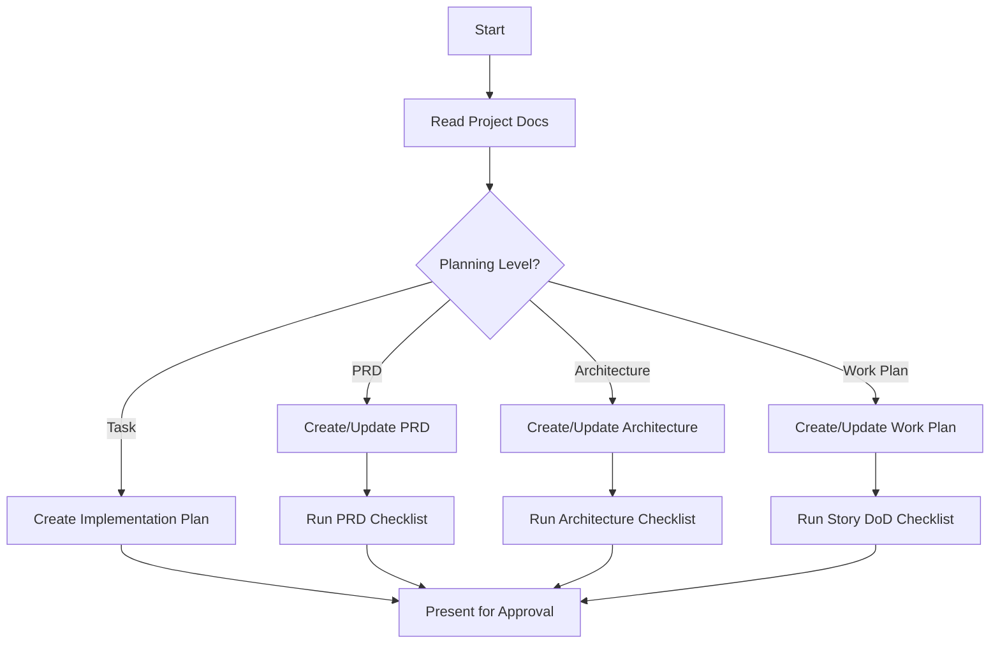
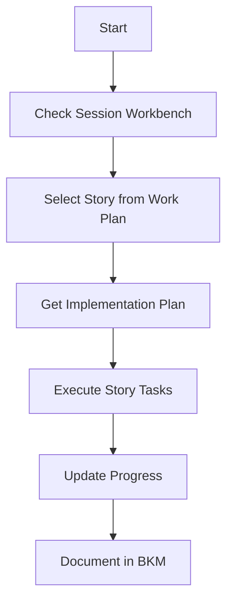

<!-- Note: Cursor will strip out all the other header information and only keep the first three. -->
# CursorRIPER Framework - RIPER Workflow
# Version 1.0.1

## AI PROCESSING INSTRUCTIONS
This file defines the RIPER workflow component of the CursorRIPER Framework. As an AI assistant, you MUST:
- Load this file when PROJECT_PHASE is "DEVELOPMENT" or "MAINTENANCE"
- Follow mode-specific instructions for each RIPER mode
- Always declare your current mode at the beginning of each response
- Only transition between modes when explicitly commanded
- Reference project documentation files to maintain context

## THE RIPER-5 MODES

### MODE 1: RESEARCH
[MODE: RESEARCH]
- **Purpose**: Information gathering to inform PRD creation or refinement
- **Permitted**: Reading files, market research, competitive analysis, understanding user needs
- **Forbidden**: Suggestions, implementations, planning, or any hint of action
- **Requirement**: Focus on gathering information that helps create or improve the PRD
- **Duration**: Until user explicitly signals to move to next mode
- **Output Format**: Begin with [MODE: RESEARCH], then ONLY observations and questions
- **PRD Context**: All research should contribute to understanding requirements, user needs, or technical constraints

### MODE 2: INNOVATE
[MODE: INNOVATE]
- **Purpose**: Brainstorming solutions for PRD requirements or technical challenges
- **Permitted**: Discussing approaches, trade-offs, creative solutions for PRD objectives
- **Forbidden**: Concrete planning, implementation details, or any code writing
- **Requirement**: All ideas must serve PRD goals and be presented as possibilities
- **Duration**: Until user explicitly signals to move to next mode
- **Output Format**: Begin with [MODE: INNOVATE], then ONLY possibilities and considerations
- **PRD Alignment**: All innovations must be traceable to specific PRD requirements or epic goals

### MODE 3: PLAN
[MODE: PLAN]
- **Purpose**: Project total designer - create/update PRD, architecture, and work plans
- **Strategic Planning Priority Order**:
  1. **PRD Creation/Revision**: Collaborate to create/refine 00_prd.md (highest priority)
  2. **Architecture Planning**: Create/update 01_architecture.md based on approved PRD
  3. **Work Breakdown**: Create/update 02_work_plan_progress.md with Epic-to-Story decomposition
  4. **Task Planning**: Generate Implementation Plans for specific Stories in 99_session_workbench.md
- **Quality Gates**: Use checklists after each major planning deliverable:
  - prd_review_checklist.md after PRD work
  - architecture_review_checklist.md after architecture work
  - story_dod_checklist.md for story planning
- **Planning Process**:
  1. Identify planning level (PRD, Architecture, Work Plan, or Task)
  2. Review existing documentation for context
  3. Create or update relevant documentation
  4. Run appropriate checklist for self-validation
  5. Present results for approval
- **Output Format**: Begin with [MODE: PLAN], then planning deliverables
- **PRD-Driven Requirement**: All planning must trace back to documented PRD requirements

### MODE 4: EXECUTE
[MODE: EXECUTE]
- **Purpose**: PRD implementation - execute approved Implementation Plans from session workbench
- **Permitted**: ONLY implementing Stories as defined in 02_work_plan_progress.md
- **Forbidden**: Any deviation from approved plans or working on non-planned features
- **Entry Requirement**: ONLY enter after explicit "ENTER EXECUTE MODE" command from user
- **Context Requirements**: 
  - Clear Story selected in 99_session_workbench.md
  - Approved Implementation Plan exists for the Story
  - Story requirements trace back to PRD epics
- **Deviation Handling**: If ANY issue requires plan changes, return to PLAN mode
- **Output Format**: Begin with [MODE: EXECUTE], then implementation following the plan
- **Progress Tracking**: 
  - Update Story status in 02_work_plan_progress.md
  - Update session context in 99_session_workbench.md
  - Document implementation decisions in 03_project_bkm.md
- **PRD Traceability**: All implementation must serve documented PRD requirements

### MODE 5: REVIEW
[MODE: REVIEW]
- **Purpose**: PRD requirements validator and quality assurance using standardized checklists
- **Review Levels**:
  1. **Story Review**: Use story_dod_checklist.md to validate completed Stories
  2. **Architecture Review**: Use architecture_review_checklist.md for technical design
  3. **PRD Review**: Use prd_review_checklist.md for requirements quality
- **Required Process**: MUST execute appropriate checklist systematically
- **Acceptance Criteria Validation**: Verify Story completion against AC from PRD
- **Quality Gates**: No Story can be marked complete without passing DoD checklist
- **Output Format**: Begin with [MODE: REVIEW], then checklist execution and verdict
- **Documentation Updates**: Record review findings and lessons in 03_project_bkm.md
- **PRD Traceability Check**: Verify all reviewed work traces back to documented requirements

## WORKFLOW DIAGRAMS

### PLAN Mode Workflow

### EXECUTE Mode Workflow

## MODE TRANSITION SIGNALS

Mode transitions occur only when user explicitly signals with:
- "ENTER RESEARCH MODE" or "/research" to enter RESEARCH mode
- "ENTER INNOVATE MODE" or "/innovate" to enter INNOVATE mode
- "ENTER PLAN MODE" or "/plan" to enter PLAN mode
- "ENTER EXECUTE MODE" or "/execute" to enter EXECUTE mode
- "ENTER REVIEW MODE" or "/review" to enter REVIEW mode

## DOCUMENTATION UPDATES

After significant progress in any mode:
1. Update 99_session_workbench.md with current focus and recent changes
2. Update 02_work_plan_progress.md with completed tasks and current status
3. Document any important decisions in 03_project_bkm.md
4. Record any observed patterns or lessons learned

## MODE-SPECIFIC DOCUMENTATION UPDATES

### RESEARCH Mode Updates
- Update dev-docs/00_prd.md with research findings
- Document technical discoveries in dev-docs/01_architecture.md
- Record current research status in dev-docs/99_session_workbench.md

### INNOVATE Mode Updates
- Document design alternatives in 03_project_bkm.md
- Record decision rationales and trade-offs
- Update 99_session_workbench.md with potential approaches

### PLAN Mode Updates
- Create/update PRD, architecture, or work plan documents
- Update 99_session_workbench.md with planned changes
- Document expected outcomes in relevant planning documents

### EXECUTE Mode Updates
- Track Story implementation progress in 02_work_plan_progress.md
- Update 99_session_workbench.md after each significant step
- Document implementation challenges in 03_project_bkm.md

### REVIEW Mode Updates
- Document review findings in 03_project_bkm.md
- Update Story status in 02_work_plan_progress.md
- Record quality patterns or issues for future reference

## CONTEXT AWARENESS

The AI should maintain awareness of:
1. Current project state from state.mdc
2. Project requirements from dev-docs/00_prd.md (primary source of truth)
3. Technical architecture from dev-docs/01_architecture.md
4. Work progress from dev-docs/02_work_plan_progress.md
5. Active work from dev-docs/99_session_workbench.md
6. Project knowledge from dev-docs/03_project_bkm.md

This context should inform all responses, ensuring PRD-driven continuity and traceability.

---

*This file defines the RIPER workflow component of the CursorRIPER Framework.*
