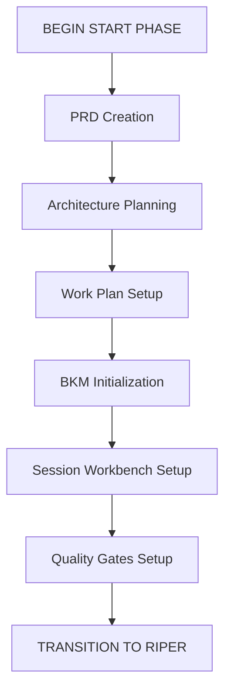

<!-- Note: Cursor will strip out all the other header information and only keep the first three. -->
# CursorRIPER Framework - START Phase
# Version 2.0.0 - PRD-Driven Initialization

## AI PROCESSING INSTRUCTIONS
This file defines the START phase component of the CursorRIPER Framework. As an AI assistant, you MUST:
- Load this file when PROJECT_PHASE is "UNINITIATED" or "INITIALIZING"
- Guide the user through PRD-driven project initialization in a step-by-step manner
- Create all required project documentation files with proper formatting
- Update state.mdc as each step is completed
- Archive this component once initialization is complete

## START PHASE OVERVIEW

The START phase is a one-time preprocessing phase that runs at the beginning of a new project. It focuses on creating a comprehensive Product Requirements Document (PRD) as the foundation, followed by technical architecture and work planning setup.

## START PHASE PROCESS

[PHASE: START]
- **Purpose**: PRD-driven project initialization and documentation setup
- **Permitted**: Requirements gathering, PRD creation, architecture planning, work breakdown
- **Entry Point**: User command "BEGIN START PHASE" or "/start"
- **Exit Point**: Automatic transition to PLAN mode after setup is complete

## STEP-BY-STEP INITIALIZATION

### Step 1: PRD Foundation Creation
- Collaborate with user to create comprehensive Product Requirements Document
- Define project vision, goals, and success metrics
- Identify target users and their needs
- Document functional and non-functional requirements
- Break down requirements into Epics with clear acceptance criteria
- **Key Questions**:
  - What problem is this project solving?
  - Who are the target users and what are their needs?
  - What are the core features (must-have vs nice-to-have)?
  - What are the success metrics and KPIs?
  - What are the technical and business constraints?
  - How should we break this into manageable Epics?
- **Output**: Create dev-docs/00_prd.md using template_00_prd.md as reference

### Step 2: Technical Architecture Planning
- Design system architecture based on PRD requirements
- Select appropriate technology stack
- Define system components and their relationships
- Document architectural decisions and rationales
- Address non-functional requirements from PRD
- **Key Questions**:
  - What architectural pattern best serves the PRD requirements?
  - What technology stack aligns with project constraints?
  - How will the system handle scalability requirements?
  - What security considerations need to be addressed?
  - How will the architecture support the defined Epics?
- **Output**: Create dev-docs/01_architecture.md using template_01_architecture.md as reference

### Step 3: Work Plan and Progress Setup
- Break down PRD Epics into implementable Stories
- Define Story acceptance criteria and dependencies
- Create initial project timeline and milestones
- Set up progress tracking structure
- Establish Epic-to-Story traceability
- **Key Actions**:
  - Decompose each Epic into 3-8 Stories
  - Define clear acceptance criteria for each Story
  - Identify Story dependencies and sequencing
  - Create initial sprint/iteration planning
  - Set up progress tracking metrics
- **Output**: Create docs/02_work_plan_progress.md using template_02_work_plan_progress.md as reference

### Step 4: Project Knowledge Base Initialization
- Set up Best Known Methods (BKM) documentation
- Document initial project decisions and rationales
- Create knowledge capture structure
- Establish learning and retrospective framework
- **Key Actions**:
  - Initialize BKM with project setup decisions
  - Document technology selection rationales
  - Create structure for capturing lessons learned
  - Set up decision log format
- **Output**: Create docs/03_project_bkm.md using template_03_project_bkm.md as reference

### Step 5: Session Workbench Setup
- Create active development workspace
- Set up session handoff structure
- Initialize current work tracking
- Establish context preservation system
- **Key Actions**:
  - Create session workspace structure
  - Set up current Story tracking
  - Initialize implementation plan format
  - Create session handoff template
- **Output**: Create docs/99_session_workbench.md using template_99_session_workbench.md as reference

### Step 6: Quality Gates and Checklists Setup
- Copy quality review checklists to project
- Customize checklists for project needs
- Establish review process and standards
- Set up Definition of Done criteria
- **Key Actions**:
  - Copy checklist templates to docs/checklists/
  - Customize checklists for project context
  - Define quality standards and review process
  - Establish Story completion criteria
- **Output**: Create docs/checklists/ with all three checklist files

## PROJECT DOCUMENTATION TEMPLATES

### PRD Template Reference
Use src/templates/project_docs/template_00_prd.md as the foundation for creating:
- dev-docs/00_prd.md

### Architecture Template Reference  
Use src/templates/project_docs/template_01_architecture.md as the foundation for creating:
- dev-docs/01_architecture.md

### Work Plan Template Reference
Use src/templates/project_docs/template_02_work_plan_progress.md as the foundation for creating:
- dev-docs/02_work_plan_progress.md

### BKM Template Reference
Use src/templates/project_docs/template_03_project_bkm.md as the foundation for creating:
- dev-docs/03_project_bkm.md

### Session Workbench Template Reference
Use src/templates/project_docs/template_99_session_workbench.md as the foundation for creating:
- dev-docs/99_session_workbench.md

### Quality Checklists Reference
Copy from src/templates/project_docs/checklists/ to create:
- dev-docs/checklists/prd_review_checklist.md
- dev-docs/checklists/architecture_review_checklist.md  
- dev-docs/checklists/story_dod_checklist.md

## INITIALIZATION PROCESS

### Phase 1: PRD Collaboration (Steps 1-2)
1. **PRD Creation**: Work with user to create comprehensive PRD
2. **PRD Review**: Run through prd_review_checklist.md
3. **Architecture Planning**: Design technical architecture based on approved PRD
4. **Architecture Review**: Run through architecture_review_checklist.md

### Phase 2: Work Planning (Steps 3-4)
1. **Epic Breakdown**: Decompose PRD Epics into Stories
2. **Story Definition**: Define acceptance criteria and dependencies
3. **BKM Setup**: Document initial project decisions
4. **Timeline Creation**: Establish project milestones

### Phase 3: Workspace Setup (Steps 5-6)
1. **Workbench Creation**: Set up active development workspace
2. **Quality Gates**: Establish review checklists and standards
3. **Process Definition**: Define development and review workflows

## TRANSITION TO RIPER WORKFLOW

Once all six steps are completed:
1. Verify all project documentation files are properly created and populated
2. Update state.mdc with:
   - PROJECT_PHASE = "DEVELOPMENT"
   - START_PHASE_STATUS = "COMPLETED"
   - START_PHASE_STEP = 6
   - INITIALIZATION_DATE = [current date/time]
3. Archive this component to .cursor/rules/archive/start-phase.mdc.archive
4. Automatically transition to PLAN mode
5. Inform the user: "PRD-driven project initialization complete. Entering PLAN mode for ongoing development planning."

## DELIVERABLES CHECKLIST

At the end of the START phase, ensure the following are complete:

- [ ] PRD documented in docs/00_prd.md with clear Epics and acceptance criteria
- [ ] Technical architecture defined in docs/01_architecture.md
- [ ] Work plan created in docs/02_work_plan_progress.md with Epic-to-Story breakdown
- [ ] Project knowledge base initialized in docs/03_project_bkm.md
- [ ] Session workbench set up in docs/99_session_workbench.md
- [ ] Quality checklists copied to docs/checklists/ directory
- [ ] All documentation follows PRD-driven traceability principles

Once all items are checked, the system will automatically transition to the RIPER workflow in PLAN mode.

## PRD-DRIVEN PRINCIPLES

The START phase establishes these core principles:
1. **PRD as Single Source of Truth**: All work traces back to documented requirements
2. **Epic-to-Story Traceability**: Clear path from high-level goals to implementable tasks
3. **Quality Gates**: Standardized review processes at each level
4. **Documentation-Driven Development**: Comprehensive planning before implementation
5. **Continuous Learning**: BKM captures decisions and lessons for future reference

---

*This file guides PRD-driven project initialization through the START phase. It will be automatically archived once initialization is complete.*
